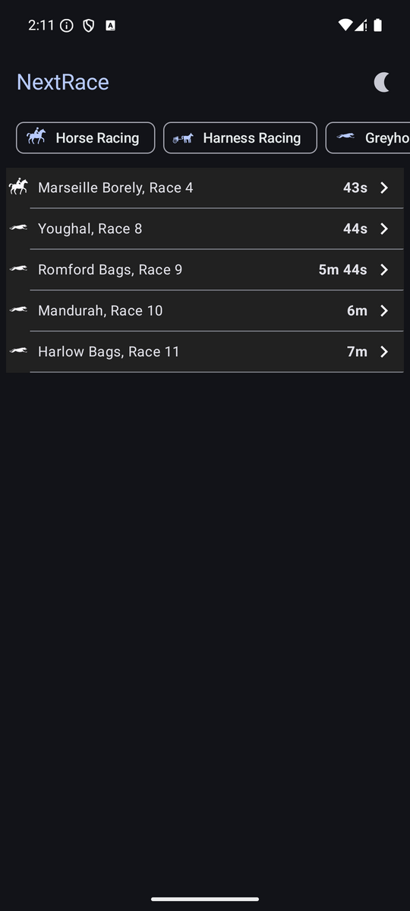
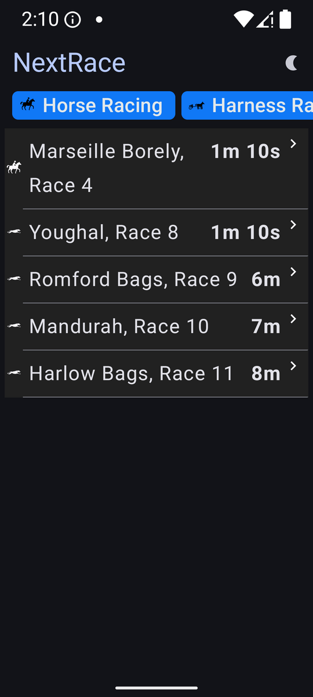

# NextRace - Entain Technical Task

## 📌 Project Overview
NextRace is an Android application that fetches and displays a list of upcoming races, including horse racing, harness racing, and greyhound racing. The app ensures that races are filtered, sorted, and automatically refreshed, providing a seamless and real-time betting experience.

## 🚀 Features
- **Fetch & Display Next 5 Upcoming Races** (sorted by start time)
- **Filter by Race Type** (Horse Racing, Harness Racing, Greyhound Racing)
- **Auto-refresh for Real-Time Updates**
- **Dark Mode, Light Mode, and Auto Theme Support**
- **Error Handling for Network Issues and Empty Data**
- **Jetpack Compose UI with Accessibility Support**
- **Timber Logging** for better debugging insights
- **CI/CD Integration with GitHub Actions & Fastlane**

## 🛠️ Tech Stack
| Technology        | Usage |
|------------------|-------------------------------------------|
| **Jetpack Compose** | UI Rendering (Modern UI Framework) |
| **Coroutines + Flows** | Asynchronous data fetching & UI updates |
| **Retrofit** | API calls |
| **Moshi** | JSON Parsing |
| **Hilt (Dagger)** | Dependency Injection |
| **ViewModel** | State management |
| **Turbine** | Testing `Flow` emissions |
| **MockK** | Unit testing dependencies |
| **Compose Navigation** | Screen navigation |
| **Detekt** | Static Code Analysis |
| **Spotless** | Code Formatting |
| **OkHttpLoggingInterceptor** | Network Logging |
| **Core Library Desugaring** | Enables modern Java features on older Android versions |
| **Room Database** | Local data persistence (Future Enhancement) |
| **Shimmer Effect** | UI loading animations |
| **Timber** | Logging framework for debugging |
| **Fastlane** | Automated build and deployment |
| **GitHub Actions** | CI/CD automation for builds and tests |

## 📸 Screenshots

### No Internet State


### Applied Filter


### Dark Mode No Filter


### Accessibility


### Light State


## 🌍 API Details
- **Endpoint Used:**
  ```
  GET https://api.neds.com.au/rest/v1/racing/?method=nextraces&count=30
  ```
- **Categories Used:**
  - **Horse Racing** → `4a2788f8-e825-4d36-9894-efd4baf1cfae`
  - **Harness Racing** → `161d9be2-e909-4326-8c2c-35ed71fb460b`
  - **Greyhound Racing** → `9daef0d7-bf3c-4f50-921d-8e818c60fe61`

### **Issue Observed:**
- When fetching with a count of `10`, sometimes the API returns all races from the same category.
- To ensure a diverse set of 5 races, I increased the request count from `10` to `30`.


## 🏗️ Architecture
The project follows a **Clean Architecture** with **MVVM (Model-View-ViewModel)**:

```
│── app/                # Handles navigation, themes, and main app structure
│── core/               # Shared modules independent of the Android framework
│── data/               # Data layer responsible for API communication
│── domain/             # Business logic layer (pure Kotlin, no Android dependencies)
│── feature-dashboard/  # Dashboard module, the main page after the splash screen
│── ui-common/          # Reusable UI components used across the application
│── gradle/             # Gradle-related configurations
│── config/             # Detekt and other static analysis configurations
│── .github/workflows/  # GitHub Actions CI/CD setup
│── fastlane/           # Fastlane scripts for automated deployment
```

## 🔬 Testing
### **Unit Tests**
- **MockK** for dependency mocking
- **Turbine** for `Flow` emission testing
- **Kotlin Coroutines Test** for async operations

## 🚀 CI/CD Pipeline
The project is automated with **GitHub Actions** and **Fastlane**:
- **GitHub Actions** runs tests on every commit and PR.
- **Fastlane** is configured for **running test**.


## ⚙️ Code Quality & Formatting
- **Detekt**: Static code analysis to enforce best practices
  ```sh
  ./gradlew detekt
  ```
- **Spotless**: Code formatting and style enforcement
  ```sh
  ./gradlew spotlessCheck || ./gradlew spotlessApply
  ```

## 🔥 Decision Making & Assumptions
### **Design Inspiration**
The UI and functionality were influenced by:
- **[Neds.com.au](https://www.neds.com.au/)** (as referenced in the PDF)
- **TAB NZ**

### **Filter Selection Reset**
- Since this is a sports betting app, users must always see the latest race information.
- Filters reset **every time the user opens the app** to avoid confusion.
- This prevents a scenario where a user might mistakenly think **some races are missing** due to an old filter selection.

### **In-Memory Cache vs Room Database**
- Due to time constraints, **an in-memory cache was used** instead of a **Room Database**.
- However, the architecture allows easy migration to **Room DB** if needed.

### **Minimum Android Version**
- The app supports **API 24 and above**.
- **Icons Source:** The Noun Project.
- **IDE Used:** Android Studio **Ladybug Feature Drop | 2024.2.2 Patch 1**.

## 🔧 Setup & Run
1️⃣ **Clone the Repository:**
```sh
git clone https://github.com/Nelzz/EntainTest.git
cd EntainTest
```

2️⃣ **Open in Android Studio**
- Open the project in **Android Studio (Giraffe or latest)**
- Allow Gradle to sync.

3️⃣ **Run the App**
```sh
./gradlew installDebug
```

4️⃣ **Run Unit Tests**
```sh
./gradlew testDebugUnitTest
```
or 
```sh
fastlane test
```

## 📦 Dependencies (Updated Versions)
```kotlin
dependencies {
    implementation "androidx.core:core-ktx:1.15.0"
    implementation "androidx.datastore:datastore-preferences:1.1.2"
    implementation "androidx.navigation:navigation-compose:2.8.7"
    implementation "androidx.room:room-runtime:2.6.1"
    kapt "androidx.room:room-compiler:2.6.1"
    implementation "com.valentinilk.shimmer:compose-shimmer:1.3.2"
    implementation "com.squareup.retrofit2:retrofit:2.11.0"
    implementation "com.squareup.retrofit2:converter-moshi:2.11.0"
    implementation "com.google.dagger:hilt-android:2.54"
    kapt "com.google.dagger:hilt-compiler:2.54"
    implementation "com.squareup.okhttp3:logging-interceptor:4.12.0"
    implementation "com.jakewharton.timber:timber:5.0.1"
    coreLibraryDesugaring("com.android.tools:desugar_jdk_libs:2.1.4")
    testImplementation "io.mockk:mockk:1.13.16"
    testImplementation "app.cash.turbine:turbine:1.2.0"
    testImplementation "org.jetbrains.kotlinx:kotlinx-coroutines-test:1.10.1"
}
```

## 📜 License
This project is licensed under the **MIT License**.

---
**Developed by Nelson Altares | Entain Technical Task Submission** 🚀🔥

